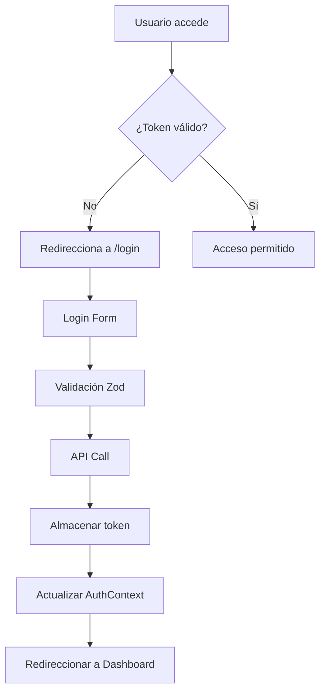
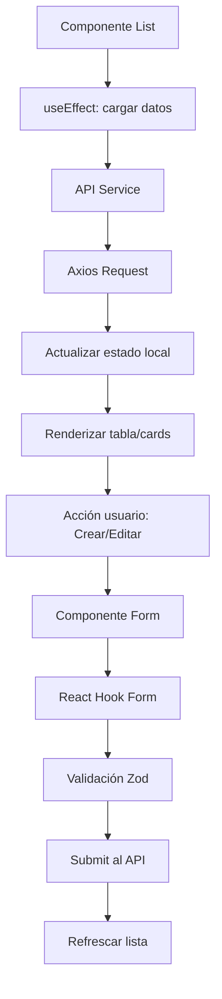
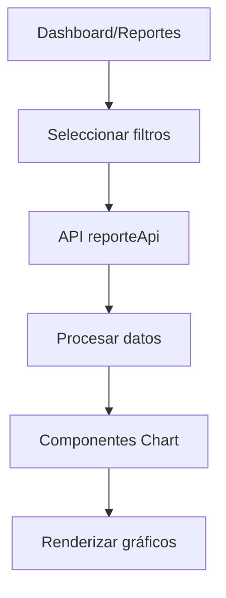

# 🏗️ Arquitectura del Sistema MiniMarket POS

## 📋 Información General

**Proyecto:** Sistema de Punto de Venta (POS) para MiniMarket
**Tipo:** Aplicación Web Frontend SPA (Single Page Application)
**Framework:** React 19.1.0 con Vite
**Diseño:** TailwindCSS 4.1.8 + DaisyUI 5.0.43
**Gestión de Estado:** Zustand + React Context
**Enrutamiento:** React Router DOM 7.6.2

---

## 🎯 Arquitectura General

El proyecto sigue una **arquitectura modular basada en características (Feature-Based Architecture)** que organiza el código por funcionalidades de negocio en lugar de por tipo de archivo técnico.

```
┌─────────────────────────────────────────────────────────────┐
│                    PRESENTATION LAYER                       │
│  ┌─────────────┐  ┌──────────────┐  ┌─────────────────────┐ │
│  │   Routes    │  │  Components  │  │      Modules        │ │
│  │             │  │   (UI Kit)   │  │   (Features)        │ │
│  └─────────────┘  └──────────────┘  └─────────────────────┘ │
├─────────────────────────────────────────────────────────────┤
│                    BUSINESS LAYER                           │
│  ┌─────────────┐  ┌──────────────┐  ┌─────────────────────┐ │
│  │   Context   │  │    Hooks     │  │      Schemas        │ │
│  │  (State)    │  │  (Logic)     │  │   (Validation)      │ │
│  └─────────────┘  └──────────────┘  └─────────────────────┘ │
├─────────────────────────────────────────────────────────────┤
│                      DATA LAYER                             │
│  ┌─────────────┐  ┌──────────────┐  ┌─────────────────────┐ │
│  │     API     │  │    Config    │  │       Auth          │ │
│  │ (Services)  │  │              │  │                     │ │
│  └─────────────┘  └──────────────┘  └─────────────────────┘ │
└─────────────────────────────────────────────────────────────┘
```

---

## 📁 Estructura de Directorios

### 🌳 Árbol de Proyecto

```
src/
├── 🎯 main.jsx                    # Punto de entrada de la aplicación
├── 📱 App.jsx                     # Componente raíz con providers
├── 🎨 App.css                     # Estilos globales
├── 🎨 index.css                   # Estilos base y TailwindCSS
│
├── 🔐 auth/                       # Módulo de Autenticación
│   ├── Login.jsx                  # Componente de login
│   ├── ProtectedRoute.jsx         # HOC para rutas protegidas
│   └── useAuth.js                 # Hook de autenticación
│
├── 🌐 api/                        # Capa de Servicios (Data Layer)
│   ├── axiosInstance.js           # Configuración de Axios
│   ├── categoriaApi.js            # API de categorías
│   ├── clienteApi.js              # API de clientes
│   ├── productoApi.js             # API de productos
│   ├── ventaApi.js                # API de ventas
│   ├── reporteApi.js              # API de reportes
│   └── reporteApiSimulated.js     # Mock de reportes
│
├── 🧩 components/                 # Componentes Reutilizables (UI Kit)
│   ├── Button.jsx                 # Botón estándar
│   ├── InputField.jsx             # Campo de entrada
│   ├── Layout.jsx                 # Layout principal
│   ├── Navbar.jsx                 # Barra de navegación
│   ├── Sidebar.jsx                # Barra lateral
│   ├── StatCard.jsx               # Tarjeta de estadísticas
│   └── charts/                    # Componentes de gráficos
│       ├── BarChart.jsx           # Gráfico de barras
│       ├── DoughnutChart.jsx      # Gráfico circular
│       └── LineChart.jsx          # Gráfico de líneas
│
├── ⚙️ config/                     # Configuración
│   └── index.js                   # Variables de entorno
│
├── 🗂️ context/                    # Gestión de Estado Global
│   └── AuthContext.jsx            # Contexto de autenticación
│
├── 🪝 hooks/                      # Hooks Personalizados
│   └── useSimulatedData.js        # Hook para datos simulados
│
├── 🚦 routes/                     # Configuración de Rutas
│   └── AppRouter.jsx              # Router principal
│
└── 📦 modules/                    # Módulos de Funcionalidades
    ├── 📊 dashboard/
    │   └── Dashboard.jsx          # Panel principal
    │
    ├── 📂 categorias/
    │   ├── CategoriaForm.jsx      # Formulario de categorías
    │   ├── CategoriaList.jsx      # Lista de categorías
    │   └── schema/
    │       └── categoria.schema.js # Validación de categorías
    │
    ├── 👥 clientes/
    │   ├── ClienteForm.jsx        # Formulario de clientes
    │   ├── ClienteList.jsx        # Lista de clientes
    │   └── schema/
    │       └── cliente.schema.js  # Validación de clientes
    │
    ├── 📦 productos/
    │   ├── ProductoForm.jsx       # Formulario de productos
    │   ├── ProductoList.jsx       # Lista de productos
    │   └── schema/
    │       └── producto.schema.js # Validación de productos
    │
    ├── 💰 ventas/
    │   ├── NuevaVenta.jsx         # Componente de nueva venta
    │   ├── VentaList.jsx          # Lista de ventas
    │   └── schema/
    │       └── venta.schema.js    # Validación de ventas
    │
    └── 📈 reportes/
        ├── ReporteList.jsx        # Lista de reportes
        ├── ReporteClientes.jsx    # Reporte de clientes
        └── ReporteVentas.jsx      # Reporte de ventas
```

---

## 🏛️ Capas de la Arquitectura

### 1️⃣ **Presentation Layer (Capa de Presentación)**

#### 🚦 Routes (`/routes`)

- **Responsabilidad:** Configuración de navegación y rutas protegidas
- **Componentes:** `AppRouter.jsx`, `ProtectedRoute.jsx`
- **Patrones:** Route Guards, Lazy Loading

#### 🧩 Components (`/components`)

- **Responsabilidad:** UI Kit reutilizable y componentes base
- **Características:**
  - Componentes agnósticos al negocio
  - Implementación de Design System (DaisyUI)
  - Props tipadas y reutilizables

#### 📦 Modules (`/modules`)

- **Responsabilidad:** Funcionalidades específicas del negocio
- **Estructura por módulo:**
  ```
  modulo/
  ├── ComponenteForm.jsx    # Formulario CRUD
  ├── ComponenteList.jsx    # Lista/tabla
  └── schema/
      └── validacion.js     # Esquemas Zod
  ```

### 2️⃣ **Business Layer (Capa de Negocio)**

#### 🗂️ Context (`/context`)

- **Responsabilidad:** Estado global de la aplicación
- **Tecnología:** React Context API
- **Casos de uso:** Autenticación, configuración global

#### 🪝 Hooks (`/hooks`)

- **Responsabilidad:** Lógica de negocio reutilizable
- **Patrones:** Custom Hooks, Estado local encapsulado
- **Ejemplos:** `useAuth`, `useSimulatedData`

#### ✅ Schemas (`/modules/*/schema`)

- **Responsabilidad:** Validación y tipado de datos
- **Tecnología:** Zod + React Hook Form
- **Beneficios:** Type Safety, validación del lado cliente

### 3️⃣ **Data Layer (Capa de Datos)**

#### 🌐 API (`/api`)

- **Responsabilidad:** Comunicación con backend/servicios externos
- **Tecnología:** Axios con interceptors
- **Patrones:** Repository Pattern, Error Handling centralizado

#### ⚙️ Config (`/config`)

- **Responsabilidad:** Variables de entorno y configuración
- **Contenido:** URLs de API, configuraciones de tema

#### 🔐 Auth (`/auth`)

- **Responsabilidad:** Gestión de autenticación y autorización
- **Funcionalidades:** Login, protección de rutas, gestión de tokens

---

## 🎨 Stack Tecnológico

### **Frontend Core**

| Tecnología     | Versión | Propósito               |
| -------------- | ------- | ----------------------- |
| ⚛️ React       | 19.1.0  | Biblioteca UI           |
| ⚡ Vite        | 6.3.5   | Build Tool & Dev Server |
| 🎨 TailwindCSS | 4.1.8   | CSS Framework           |
| 🌼 DaisyUI     | 5.0.43  | Component Library       |

### **Gestión de Estado**

| Tecnología       | Versión  | Propósito               |
| ---------------- | -------- | ----------------------- |
| 🏪 Zustand       | 5.0.5    | Estado global ligero    |
| ⚛️ React Context | Built-in | Estado de autenticación |

### **Navegación y Routing**

| Tecnología          | Versión | Propósito        |
| ------------------- | ------- | ---------------- |
| 🚦 React Router DOM | 7.6.2   | Enrutamiento SPA |

### **Formularios y Validación**

| Tecnología             | Versión | Propósito              |
| ---------------------- | ------- | ---------------------- |
| 📝 React Hook Form     | 7.57.0  | Gestión de formularios |
| ✅ Zod                 | 3.25.50 | Validación de esquemas |
| 🔗 @hookform/resolvers | 5.0.1   | Integración Zod + RHF  |

### **HTTP y API**

| Tecnología    | Versión | Propósito                |
| ------------- | ------- | ------------------------ |
| 🌐 Axios      | 1.9.0   | Cliente HTTP             |
| 🔐 JWT Decode | 4.0.0   | Decodificación de tokens |

### **Visualización de Datos**

| Tecnología         | Versión | Propósito                   |
| ------------------ | ------- | --------------------------- |
| 📊 Chart.js        | 4.5.0   | Gráficos base               |
| ⚛️ React ChartJS 2 | 5.3.0   | Wrapper React para Chart.js |
| 📈 Recharts        | 2.15.4  | Gráficos nativos React      |

### **Utilidades**

| Tecnología     | Versión | Propósito                   |
| -------------- | ------- | --------------------------- |
| 🎨 clsx        | 2.1.1   | Concatenación de clases CSS |
| 📅 date-fns    | 4.1.0   | Manipulación de fechas      |
| 🎯 React Icons | 5.5.0   | Iconografía                 |

---

## 🔄 Flujo de Datos

### **1. Flujo de Autenticación**



### **2. Flujo CRUD Estándar**



### **3. Flujo de Reportes**



---

## 🔧 Patrones de Diseño Implementados

### **1. Module Pattern (Arquitectura Modular)**

- Cada funcionalidad del negocio vive en su propio módulo
- Encapsulación de componentes, schemas y lógica relacionada
- Facilita mantenimiento y escalabilidad

### **2. Container/Presentational Pattern**

- **Container Components:** Manejan estado y lógica (`*List.jsx`)
- **Presentational Components:** Solo renderización (`components/`)

### **3. Custom Hooks Pattern**

- Encapsulación de lógica reutilizable
- Separación de concerns entre UI y lógica de negocio
- Ejemplos: `useAuth`, `useSimulatedData`

### **4. Repository Pattern (API Layer)**

- Abstracción del acceso a datos
- Cada entidad tiene su propio servicio API
- Facilita testing y cambios de backend

### **5. Provider Pattern**

- Gestión de estado global con Context API
- Inyección de dependencias (AuthContext)

### **6. Route Guard Pattern**

- Protección de rutas con `ProtectedRoute`
- Verificación de autenticación antes del acceso

---

## 🚀 Comandos de Desarrollo

```bash
# Instalación de dependencias
npm install

# Desarrollo local
npm run dev

# Build para producción
npm run build

# Preview del build
npm run preview

# Linting
npm run lint
```

---

## 📚 Convenciones y Estándares

### **📂 Nomenclatura de Archivos**

- **Componentes:** PascalCase (`ProductoForm.jsx`)
- **Hooks:** camelCase con prefijo `use` (`useAuth.js`)
- **Servicios API:** camelCase con sufijo `Api` (`productoApi.js`)
- **Schemas:** camelCase con sufijo `.schema` (`producto.schema.js`)

### **🎨 Estándares de UI**

- **Solo clases DaisyUI:** No colores hardcodeados
- **Iconos contextuales:** React Icons en formularios
- **Responsive Design:** Mobile-first con TailwindCSS
- **Form Controls:** Estructura estándar con `form-control`

### **✅ Validación**

- **Esquemas Zod:** Validación tipada del lado cliente
- **React Hook Form:** Gestión de formularios performante
- **Mensajes de error:** Usando clases `text-error` de DaisyUI

### **🗂️ Organización del Estado**

- **Estado local:** React useState/useReducer
- **Estado global:** Context API para auth, Zustand para otros casos
- **Estado del servidor:** React Query (pendiente implementar)

---

## 🔮 Próximas Mejoras

### **📈 Performance**

- [ ] Implementar React Query para caching
- [ ] Lazy loading de módulos
- [ ] Optimización de bundle size

### **🧪 Testing**

- [ ] Unit tests con Vitest
- [ ] Integration tests con Testing Library
- [ ] E2E tests con Playwright

### **🔒 Seguridad**

- [ ] Refresh tokens automático
- [ ] Validación de permisos por rol
- [ ] Sanitización de inputs

### **📱 UX/UI**

- [ ] Modo oscuro/claro
- [ ] Internacionalización (i18n)
- [ ] PWA capabilities
- [ ] Notificaciones push

### **⚡ DevEx**

- [ ] TypeScript migration
- [ ] Storybook para componentes
- [ ] Husky + lint-staged
- [ ] Conventional commits

---

## 📊 Métricas del Proyecto

| Métrica                | Valor                                                            |
| ---------------------- | ---------------------------------------------------------------- |
| **Componentes React**  | ~25                                                              |
| **Módulos de negocio** | 5 (Dashboard, Productos, Categorías, Clientes, Ventas, Reportes) |
| **Servicios API**      | 6                                                                |
| **Rutas protegidas**   | 8                                                                |
| **Dependencias**       | 20                                                               |
| **Dev Dependencies**   | 9                                                                |
| **Tamaño estimado**    | < 500KB (gzipped)                                                |

---

**📅 Última actualización:** 20 de junio de 2025
**🔧 Mantenedor:** Equipo de desarrollo MiniMarket POS
